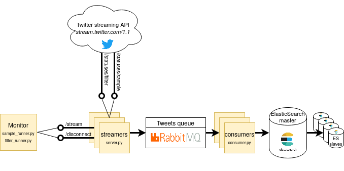

 

# Tweets collection and indexation infrastructure

Collect massive amounts of tweets using the Twitter streaming APIs and index them with ElasticSearch. 

Deal with indexing delay using a RabbitMQ queue.

We combine Twitter [Sample](https://developer.twitter.com/en/docs/tweets/sample-realtime/overview/get_statuses_sample)
and [Filter](https://developer.twitter.com/en/docs/tweets/filter-realtime/api-reference/post-statuses-filter)
streaming APIs to maximize the number of tweets.

## Summary:
* [Getting started](#getting-started)
* [Order of OAuth keys](#order-of-oauth-keys)
* [Check if streamer is running](#check-if-streamer-is-running)
* [Check if tweets are indexed](#check-if-tweets-are-indexed)
* [Text files](#text-files)
* [Turn off the stack](#turn-off-the-stack)
* [Deploy a large number of streamers](#turn-off-the-stack)
* [Paper](#paper)

## Getting started
### Resources needed
We run this infrastructure on a 250GB RAM, 16 cores RAID 5 server. 
You may not be able to run intensive indexation jobs on a desktop computer.

### HowTo
* Clone this repo: 

        git clone https://github.com/ina-foss/stream-index-massive-tweets.git
        cd stream-index-massive-tweets

* Install [Docker and docker-compose](https://docs.docker.com/compose/install/). Minimum Docker version: 17.12.1.

* [Create a Twitter developper account and a Twitter App](https://developer.twitter.com/en/docs/basics/apps/overview).
Then get the app's [OAuth access tokens](https://developer.twitter.com/en/docs/basics/authentication/guides/access-tokens).
If you have several accounts, you can get several tokens. Copy them in `config.py` within the `ACCESS` list.

* Setup other parameters in `config.py` : `KEYWORDS` the keywords you want to track, `LANG` the language of the tweets.

* Increase the [system limits on mmap counts](https://www.elastic.co/guide/en/elasticsearch/reference/current/vm-max-map-count.html) if needed:
      
   
        sudo sysctl -w vm.max_map_count=262144
* Add current user to docker group

        sudo groupadd docker
        sudo usermod -aG docker $USER
* Build the docker infrastructure

        docker-compose build
        docker swarm init
        docker network create --driver overlay net0 --attachable
        mkdir -p data/es_nodes/master data/es_nodes/slave1 data/es_nodes/slave2

* Deploy docker stack

        docker stack deploy stream-index --compose-file docker-compose.yml --with-registry-auth
  
The stack may take some minutes to be fully deployed. Check if services are deployed using
 
    docker service ls
    
In column REPLICAS, all lines should indicate 1/1.

## Order of OAuth keys
The order in which you copy OAuth access keys in the `config.yml` is important: the first
key will be used by service streamer_0, which is always streaming from the Sample API.
If you don't want to use this API, leave the first key in `ACCESS` empty
and copy your access key(s) in the next position(s) in the `ACCESS` list.

You may also remove the services streamer_0 and sample_runner from the `docker-compose.yml` file,
since they will not be used. However, the stack will not fail if you don't.

## Check if streamer is running
    
To check if a streamer is running, you can simply curl it using its port number (5050 for sample streamer,
5051, 5052, etc. for the next streamers):

    curl localhost:5050

The response should look like:

    {"key": 0, "lang": null, "track": null} 

for sample streamer, and

    {"key": 2, "lang": "fr", "track": ["je", "tu", "il", "elle", "nous"]}
    
for the other streamers.

## Check if tweets are indexed

You can visualize the indexed tweets using Kibana. Type localhost:5656 in your browser.
If it is the first time you connect on Kibana, you are redirected to the 
*Configure an index pattern* page. Type `tweets-index*` as index name
and choose `created_at` as time-field name. You can then type 
[localhost:5656/app/kibana#/discover](http://localhost:5656/app/kibana#/discover) 
in your browser to see the collected tweets.

## Text files
The tweets are both indexed and stored in json.gz files in 

    stream-index-massive-tweets/data/tweets/$year/$month/$day/$hour/$minutes

## Turn off the stack

    docker stack rm stream-index

## Deploy a large number of streamers
The current configuration provides 2 streaming servers streamer_0 and streamer_1. 
It needs 2 different Twitter Developer access tokens in the `config.py` file.

If you have more access tokens, you can add them in `config.py ` 
and add more streaming servers (streamer_2, streamer_3, etc.) similar to streamer_1 in the
`docker-compose.yml` file, then redeploy the stack.

You may then want to increase the number of consumers to speed-up indexation:
    
    docker service scale stream-index_consumer=2

## Paper
The reason why we use stop-words to collect tweets is explained in: 

Mazoyer, B., Cagé, J., Hudelot, C., & Viaud, M.-L. (2018). 
[“Real-time collection of reliable and representative tweets datasets related to news events”.](http://ceur-ws.org/Vol-2078/paper2.pdf)
 In “Proceedings of the First International Workshop on Analysis of Broad Dynamic Topics over Social Media (BroDyn 2018)”. 
 
 Please cite the paper if you use this infrastructure for research purpose.